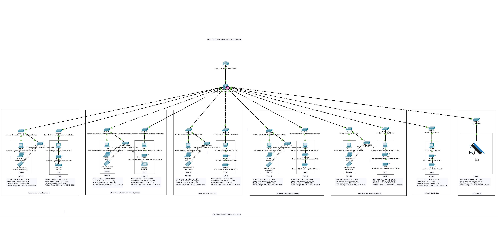

# 🌐 **University of Jaffna Network Topology Design - EC4060 Assignment** 📡

Welcome to the repository for the **EC4060 – Computer and Data Network** course assignment! This project involves designing and simulating a network infrastructure for a multi-branch institution, covering various key networking concepts using Cisco Packet Tracer. Below you'll find all the necessary resources and details about the project.

## 🔍 **Project Overview**:

This network topology design simulates the setup for a **multi-branch institution** with the following components:

- **Main Router**: ISR-321 Router 🖧
- **Main Switch**: 3650-24PS Layer 3 Switch 🔌
- **Layer 2 Switches**: 7 switches for different departments ⚙️
- **VLANs**: Separate VLANs for each department and administration 👥
- **Devices**: PCs, printers, laptops, and mobile phones in each VLAN 📱💻

### Key Requirements:
- **Separate Subnets** for 5 academic departments and 1 administration section 🧑‍🏫
- **VLAN Categorization** for logical network separation 🔐
- **Subnet Calculations** with future scalability for 30% growth 📊
- Configuration of **Routers, Switches, VLANs**, and **IP Addressing** 🔧
- **Testing Connectivity** via ping and traceroute 🧪

## 🖼️ **Network Topology Diagram**:

Here’s a visual representation of the designed network topology:

### Diagram Features:
- **Main Router (ISR-321)**: Centralized routing for the network.
- **Main Switch (3650-24PS)**: Core switch connecting multiple departments and layers.
- **Layer 2 Switches**: Separated VLANs for different departments.
- **VLANs**: Logical separation of network traffic for optimal security and performance.

## 💾 **Files Included**:

- 📂 **Network Configuration Files**: All router and switch configurations for the network setup.
- 📂 **Cisco Packet Tracer Save File**: The complete Cisco simulation file (.pkt).
- 📂 **Screenshots & Videos**: Step-by-step guide and testing results for easier understanding of the network topology.
- 📂 **Subnet Tables & VLAN Mappings**: Detailed tables for subnetting and VLAN configurations.

## 🎥 **Demonstration Videos**:

Watch the videos to see the network in action:
- 🖥️ **Initial Setup**: Overview of network design and configuration.
- 🖥️ **Connectivity Test**: Results from ping and traceroute commands.

## 📋 **Instructions to Run**:

1. **Clone or Download the Repository**:
    - Use `git clone https://github.com/your-repo-link.git` to clone the repository or download it as a ZIP file.

2. **Open the Cisco Packet Tracer File**:
    - Open the `.pkt` file in Cisco Packet Tracer to view and run the simulation.

3. **Review Configuration Files**:
    - All the necessary configuration files are included for reference. Check them for specific router and switch configurations.

4. **Watch the Videos & Check Screenshots**:
    - Videos and screenshots are available to help you understand the setup and test results.

## 📄 **Report**:

The detailed **Report** for this assignment includes:
- Subnet Tables 📊
- VLAN Mapping 🔍
- Topology Diagram 🗺️
- Test Results (ping, traceroute) 💻

## 🛠️ **Technologies Used**:

- Cisco Packet Tracer 🖥️
- IPv4 Addressing 🌐
- VLAN Configuration 🔧
- Routing & Switching 🔄

## 🔗 **Useful Links**:

- [Cisco Packet Tracer Official Site](https://www.netacad.com/courses/packet-tracer) 
- [University of Jaffna - EC4060 Course Details](https://www.jfn.ac.lk)

## 🤝 **Contributing**:

Feel free to fork this repository and submit pull requests for any improvements or suggestions! Contributions are always welcome!

